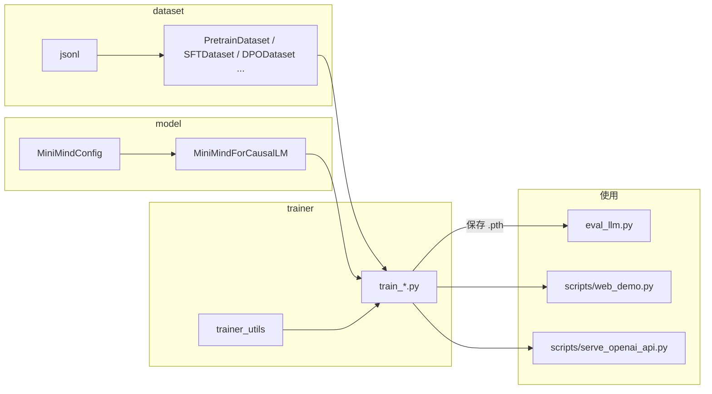

# MiniMind 学习笔记（随学随记）

> 本文档用于配合阅读 [MiniMind](https://github.com/jingyaogong/minimind) 仓库源码：整理项目结构、模块职责与调用关系。你可以在文末 **「我的记录」** 里续写自己的理解、命令与问题。  
> **专业术语**：各章节末尾有「术语简释」专块，可先扫一眼再读正文。

---

## 1. 这份笔记在讲什么

MiniMind 是一个 **从零用 PyTorch 实现极简 LLM** 的教程型项目：包含 **Dense / MoE** 结构、分词器文件、各阶段训练脚本，以及推理与 OpenAI 兼容 API 示例。核心代码不依赖高层封装即可完成预训练 → SFT → 偏好/强化等流程。

- 主说明文档：仓库根目录 [`README.md`](./README.md)

<!-- 术语注释：§1 -->
> **本节术语简释**
>
> | 术语 | 通俗含义 |
> |------|----------|
> | **LLM（大语言模型）** | 以「给定前文、预测下一个词」为核心的大规模神经网络；MiniMind 是刻意做小的同类结构，便于学习与本地训练。 |
> | **PyTorch** | Python 深度学习框架；用张量（多维数组）表示数据，自动求导用于训练。 |
> | **Dense / MoE** | **Dense**：每一层里同样的 MLP 对所有 token 生效。**MoE（混合专家）**：每层有多个「专家」小 MLP，每个 token 只激活其中少数几个，总参数可变大但单次计算更省。 |
> | **预训练 / SFT / 偏好与强化** | **预训练**：海量文本上学通用语言统计。**SFT（监督微调）**：用「问答/指令」数据教会模型按对话格式回答。**偏好/强化**：用人类偏好或奖励信号进一步对齐回答风格（如 DPO、PPO 等）。 |
> | **API** | 程序之间通过 HTTP 等协议调用的接口；这里协议形状类似 OpenAI 的聊天接口，方便接现有聊天前端。 |

---

## 2. 训练「训练出」的是什么？

| 不是 | 而是 |
|------|------|
| 不是把语料存成「向量库」当最终产品 | 是 **神经网络的参数（权重）**：大量浮点数张量 |
| 不是 `.py` 源文件里写死的数字 | 是训练过程中用梯度更新后 **保存到 checkpoint**（如 `.pth`） |

**输入**：token ID 序列；**输出**：下一 token 的概率分布。  
推理时按 `MiniMindConfig` + `MiniMindForCausalLM` 的结构做前向计算；权重来自 checkpoint。

<!-- 术语注释：§2 -->
> **本节术语简释**
>
> | 术语 | 通俗含义 |
> |------|----------|
> | **Token / token ID** | 文本先被 **分词器** 切成小单元（token），每个 token 对应词典里的一个整数编号，即 token ID；模型吃的是 ID 序列，不是原始汉字/英文。 |
> | **概率分布** | 在「下一个 token 会是谁」上，模型对每个可能的词都给一个概率；加起来为 1。采样或贪心选其中一个 ID 继续生成。 |
> | **参数 / 权重** | 网络里可训练的矩阵/向量；**训练**就是不断更新这些数，使预测更接近数据。 |
> | **前向计算（前向传播）** | 从输入算到输出（如 logits、loss）的一次完整前向过程；与 **反向传播**（算梯度）相对。 |
> | **Checkpoint** | 训练过程中保存的「快照」，通常含权重；有时还含优化器状态等，用于续训或推理加载。 |
> | **因果（Causal）LM** | 预测下一 token 时只看 **当前及之前的** 内容，不看未来；自回归生成对话即此类。 |

### 2.1 可以这样理解吗？（函数、矩阵与训练）

> **你的直觉**：token 进去，经过矩阵里的运算，输出「最接近」的下一个 token；训练就像不断优化函数内部的东西。  
> **对的部分**：的确是 **事先写定的一套计算流程**（多层矩阵乘、非线性、注意力等），像「程序结构固定，里面全是数字在动」；**训练改的是各层权重矩阵里的数值**，让模型在训练数据上 **给真实下一个 token 更高的概率**（通常用交叉熵衡量，不是几何上的「距离最近」）。  
> **建议再精确的三点**：  
> 1. **输入一般是整段上下文**（一长串 token ID），不是孤零零的一个 token；模型利用整段信息预测 **下一个**（训练时还常对每个位置同时算监督，称为 teacher forcing）。  
> 2. **「接近」**：训练目标是 **概率意义**上更准（真实词的概率拉高），和「向量空间里最近邻」不是一回事。  
> 3. **训练很少改「代码结构」**：层数、`hidden_size` 等多由 `MiniMindConfig` 定死；动的是 **`.pth` 里的参数**。类比成 **电路图不变，只调无数旋钮**，比「改写函数里的分支逻辑」更贴切。  
> **推理时常见循环**：当前前文 → 前向得到下一 token 的分布 → 贪心或采样选一个 ID → 拼回前文 → 再前向，直到 EOS 或长度上限。

---

## 3. 权重文件一般在哪？

- **架构**：在 `model/model_minimind.py` 等源码里（只定义形状与计算图，不包含训好的大矩阵）。
- **训好的参数**：训练脚本默认写到 **`../out`**（相对于在 `trainer/` 下执行时，常对应项目根下的 `out/`），文件名类似：

  `{save_dir}/{weight}_{hidden_size}[_moe].pth`

  例如：`pretrain_512.pth`、`full_sft_512.pth`。

- **续训元数据**：`trainer_utils.lm_checkpoint` 还会写 `../checkpoints` 下的 `*_resume.pth` 等。
- **分词器**：`model/tokenizer.json` 等是 **词表/BPE**，不是 Transformer 主干权重。
- **注意**：克隆下来的仓库里 **未必自带** `.pth`，需要自己训练或从 README 中的 Hugging Face / ModelScope 下载后放入对应路径。

<!-- 术语注释：§3 -->
> **本节术语简释**
>
> | 术语 | 通俗含义 |
> |------|----------|
> | **架构（结构）** | 网络有哪些层、每层输入输出维度如何接；**代码里定义的是结构，不是训练好的数字本身**。 |
> | **`.pth`** | PyTorch 常用权重文件后缀；里面多半是 **state_dict**（层名到张量的字典）。 |
> | **`hidden_size`** | 每层主隐藏向量长度；文件名里常出现，用于区分不同体量配置（如 512、640）。 |
> | **续训 / resume** | 从上次中断处接着训练；**resume 文件**里可能含优化器、步数等，不仅是模型权重。 |
> | **BPE（字节对编码）** | 一种 **子词** 分词方式：词表在「字/子词」粒度，平衡词表大小与罕见词覆盖；`tokenizer.json` 里存的是合并规则与词表，**不是** Transformer 权重。 |
> | **词表（vocab）** | 模型能输出的离散符号集合；`vocab_size` 须与分词器一致。 |
> | **Hugging Face / ModelScope** | 模型与数据集的托管平台；可下载别人发布的权重与 tokenizer。 |

---

## 4. 目录结构速查

```
minimind/
├── model/                  # 模型定义 + 自带 tokenizer 配置
│   ├── model_minimind.py   # MiniMindConfig、MiniMindForCausalLM、Block、MoE 等
│   ├── model_lora.py       # LoRA 注入与读写
│   └── tokenizer.json, tokenizer_config.json
├── dataset/                # Dataset 与示例 jsonl
│   ├── lm_dataset.py
│   ├── *.jsonl
│   └── dataset.md
├── trainer/                # 训练入口 + 公共工具
│   ├── trainer_utils.py
│   └── train_*.py
├── scripts/                # Web 演示、API、转换
├── eval_llm.py             # 本地加载权重对话 / 测速
├── requirements.txt
└── README.md
```

<!-- 术语注释：§4 -->
> **本节术语简释**
>
> | 术语 | 通俗含义 |
> |------|----------|
> | **jsonl** | 每行一个 JSON 对象的文本文件；适合大语料流式读取。 |
> | **`requirements.txt`** | 列出 Python 依赖包及版本；`pip install -r requirements.txt` 一键安装。 |
> | **`Dataset`（PyTorch）** | 描述「第 i 条样本怎么取」的对象；训练时与 `DataLoader` 配合组 batch。 |

---

## 5. 主链路（数据 → 训练 → 使用）



<!-- 术语注释：§5 -->
> **本节术语简释**
>
> | 术语 | 通俗含义 |
> |------|----------|
> | **Config（配置）** | 超参数集合：层数、维度、是否 MoE 等；决定 **建多大的模型**，不单独存训练好的矩阵。 |
> | **DataLoader** | 把 Dataset 按 batch 多线程读入并喂给训练循环。 |
> | **训练脚本 `train_*.py`** | 可执行入口：**组数据、前向、算 loss、反向、保存**。 |
> | **推理 / 生成** | 模型已训练好，只做前向，根据 logits 逐个采样新 token 拼成回答。 |

---

## 6. 分模块说明

### 6.1 `model/`

| 文件 | 作用 |
|------|------|
| `model_minimind.py` | **`MiniMindConfig`**：层数、hidden、GQA、RoPE、可选 YaRN、MoE、Flash 注意力等。**`MiniMindForCausalLM`**：因果 LM，含与 `embed_tokens` 绑定的 `lm_head`；`labels` 与 `-100` 的 CE loss；MoE 的 `aux_loss`。内部还有 RMSNorm、RoPE、Attention、FeedForward、MoE、**`MiniMindBlock`**、**`MiniMindModel`**。**（类与 `forward` 已补充中文注释/docstring）** |
| `model_lora.py` | `LoRA` 低秩层、`apply_lora`、`load_lora` / `save_lora`。 |
| `tokenizer.*` | 分词与 chat 模板，与 `vocab_size` 一致。 |

<!-- 术语注释：§6.1 model -->
> **本模块术语简释**
>
> | 术语 | 通俗含义 |
> |------|----------|
> | **Config** | 见 §5；此处特指 `MiniMindConfig`，与 Transformers 的 `config.json` 对应。 |
> | **隐藏维度 `hidden_size`** | 每层内部向量宽度，常记为 \(d_\text{model}\)；越大模型越强、越占显存。 |
> | **层数 `num_hidden_layers`** | 堆叠多少个 **Transformer Block**；越深表达能力越强，推理越慢。 |
> | **注意力（Attention）** | 让每个位置按权重「看」序列中其他位置的信息；核心是 Q/K/V 与 softmax 权重。 |
> | **GQA（分组查询注意力）** | **多组 Q 头、较少组 K/V 头**：减少 K/V 参数量与 KV 缓存，推理更省显存。 |
> | **RoPE（旋转位置编码）** | 把「第几个 token」的信息编进 Q、K 里，使模型知道顺序；**长上下文**相关。 |
> | **YaRN** | 一类 **位置编码外推**：在比训练时更长的序列上缓解位置失真；配置里与 `inference_rope_scaling` 联动。 |
> | **Flash Attention** | 高效实现注意力计算，**省显存、加速**；依赖 PyTorch SDPA 等条件。 |
> | **RMSNorm** | 层归一化的一种，稳定训练、常用在 LLaMA 系结构里。 |
> | **FFN / MLP（前馈网络）** | 每个 Block 里注意力之后的两段线性+激活；**扩大通道再压回** hidden。 |
> | **SwiGLU 等 `hidden_act`** | 前馈里的非线性激活形式；代码通过 `ACT2FN` 按名字选用。 |
> | **Decoder-only** | 只有「解码器」栈，没有独立编码器；GPT 类生成模型都是这种。 |
> | **Block** | 一层：`Norm → 注意力 → 残差 → Norm → FFN → 残差` 的典型组合（细节以代码为准）。 |
> | **`embed_tokens`（词嵌入）** | 把 token ID 查表成连续向量，作为第一层输入。 |
> | **`lm_head`（语言模型头）** | 把隐藏向量线性映射到 **词表大小** 的 logits（未归一化的分数），再 softmax 得概率。 |
> | **权重绑定（tie weights）** | **输入嵌入矩阵与输出 lm_head 共用**；减少参数，常见做法。 |
> | **CE loss（交叉熵损失）** | 分类常用损失；这里衡量「真实下一个 token」在预测分布上的负对数似然。 |
> | **`ignore_index=-100`** | 标签为这些位置 **不参与 loss**；用于只训练 assistant 段、忽略 pad 等。 |
> | **`aux_loss`（辅助损失）** | MoE 里鼓励 **专家负载均衡** 等；训练脚本里常与主 CE 相加。 |
> | **MoE（混合专家）** | 门控为每个 token 选少数专家前向；总参数量大、**激活参数量**可控制。 |
> | **LoRA（低秩适配）** | 冻结原权重，只训练贴在部分线性层上的 **小秩矩阵**；省显存、适合领域适配。 |

---

### 6.2 `dataset/`（核心：`lm_dataset.py`）

| 类 | 用途 | 典型训练脚本 |
|----|------|----------------|
| `PretrainDataset` | 字段 `text` → BOS + tokens + EOS，pad，labels 对齐；-100 屏蔽 pad | `train_pretrain.py` |
| `SFTDataset` | 对话 `conversations` → `apply_chat_template`；**只对 assistant 段** 建监督标签 | `train_full_sft.py` 等 |
| `DPODataset` | chosen / rejected 两条序列 + loss mask | `train_dpo.py` |

辅助函数：**`pre_processing_chat`**（随机 system）、**`post_processing_chat`**（reasoning 标签等处理）。

<!-- 术语注释：§6.2 dataset -->
> **本模块术语简释**
>
> | 术语 | 通俗含义 |
> |------|----------|
> | **BOS / EOS** | **Begin / End of Sequence** 特殊符号；标明序列起止，助模型学边界。 |
> | **pad（填充）** | 把一个 batch 里长短不一的序列补到同一长度；pad 位置标签常标 **-100** 不计算 loss。 |
> | **`input_ids`** | 一条样本经分词后的 token ID 序列（张量形式）。 |
> | **`labels`** | 与 `input_ids` 对齐的「预测目标」；CLM 里通常是右移一位的下一 token；不想训练的位置填 -100。 |
> | **`apply_chat_template`** | 把多轮 `role/content` 对话格式化成 **模型训练时约定的一串文本**，再 tokenize。 |
> | **user / assistant / system** | 聊天角色：**用户**、**助手**、**系统提示**（设定助手行为）。 |
> | **监督（supervision）** | 有标准答案的学习；SFT 里只对 **assistant 说的话** 算 loss，前面 instruction 只作条件。 |
> | **chosen / rejected** | **偏好数据**：同一提示下「更好」与「更差」两条回复；供 DPO 类学人类偏好。 |
> | **loss mask** | 布尔或 0/1 掩码，标哪些位置 **参与 loss**；DPO 里常只对 assistant 内容计分。 |
> | **Reasoning / 思考链** | 模型输出里带 `</think>` 等标记的「思考过程」段落；`post_processing_chat` 可做数据增强或清洗。 |

---

### 6.3 `trainer/`

| 文件 | 作用 |
|------|------|
| **`trainer_utils.py`** | `init_model`（接上一阶段 `.pth`）、`lm_checkpoint`（权重 + resume）、`get_lr`、`init_distributed_mode`、`setup_seed`、`get_model_params`（含 MoE 有效参数）等。 |
| **`train_pretrain.py`** | 预训练 CLM。 |
| **`train_full_sft.py`** | 全参 SFT；循环内 `model(input_ids, labels=labels)`，`loss = res.loss + res.aux_loss`。 |
| **`train_lora.py`** | LoRA。 |
| **`train_dpo.py`** | DPO。 |
| **`train_ppo.py` / `train_grpo.py` / `train_spo.py`** | RLAIF 类。 |
| **`train_reason.py` / `train_distillation.py`** | Reason / 蒸馏。 |
| **`train_tokenizer.py`** | BPE 训练参考；注释说明一般**不必重训**以免与社区模型不兼容。 |

<!-- 术语注释：§6.3 trainer -->
> **本模块术语简释**
>
> | 术语 | 通俗含义 |
> |------|----------|
> | **预训练（Pretrain）** | 在大规模通用文本上做 **下一词预测**；学得语言与知识基底。 |
> | **CLM（Causal Language Modeling）** | **因果语言建模**：只朝过去看，预测下一 token；与 MLM（掩码语言模型，如 BERT）不同。 |
> | **SFT（Supervised Fine-Tuning）** | 用标注好的指令–回答对微调，让模型 **会聊天、会遵循格式**。 |
> | **全参微调** | 更新 **所有** 权重；与 LoRA 等 **只更新少量参数** 相对。 |
> | **DPO（Direct Preference Optimization）** | 直接用偏好对优化策略，**省去显式奖励模型** 的一类对齐方法。 |
> | **PPO / GRPO / SPO** | **强化学习**相关算法族：用奖励信号更新策略；具体目标与方差缩减各有不同。 |
> | **RLAIF / RLHF** | **人类或 AI 反馈的强化学习**：用偏好或打分训练模型更「讨喜」、更安全。 |
> | **优化器（optimizer）** | 如 AdamW：根据梯度更新参数；**学习率 lr** 控制步长。 |
> | **学习率调度** | 训练中动态改 lr；代码里 `get_lr` 常与 **cosine** 等 schedule 相关。 |
> | **梯度累积** | 多个小 batch 的梯度加起来再一步更新，**模拟大 batch**，省显存。 |
> | **梯度裁剪（grad clip）** | 限制梯度范数，防 **梯度爆炸** 训练不稳定。 |
> | **混合精度（AMP）** | 如 bf16/fp16：部分计算用半精度，**加速、省显存**，配合 loss scaling 等。 |
> | **DDP（分布式数据并行）** | 多 GPU **各持一份模型**、数据分片并行；`init_distributed_mode` 等初始化通信。 |
> | **`wandb` / SwanLab** | 实验日志与曲线可视化工具（仓库里可用 SwanLab 替代 wandb API）。 |
> | **蒸馏（Distillation）** | 让小模型（学生）模仿大模型（教师）的输出或中间表示，**压缩能力**。 |
> | **有效参数量（MoE）** | 总参数量大，但 **每个 token 只激活部分专家**；推理成本更接近「激活参数」规模。 |

---

### 6.4 根目录 `eval_llm.py`

本地加载 `MiniMindConfig` + `.pth` 或 `from_pretrained`；可选 MoE、YaRN、LoRA；`generate` / 测速。

<!-- 术语注释：§6.4 eval -->
> **本模块术语简释**
>
> | 术语 | 通俗含义 |
> |------|----------|
> | **`from_pretrained`** | Hugging Face Transformers 从目录或 Hub **加载 config + 权重 + tokenizer** 的标准接口。 |
> | **`generate`** | 自回归 **解码**：反复「前向 → 选下一 token → 拼进输入」直到 EOS 或长度上限。 |
> | **温度 / top-p** | 采样时的随机性与多样性控制：**温度**越高越随机；**top-p** 只在累积概率达到 p 的候选里采样。 |
> | **KV Cache** | 生成时缓存已算过的 K/V，避免每步重复算全文；长生成显著加速（模型 `use_cache` 相关）。 |
> | **decode 速度（tokens/s）** | 每秒生成的 token 数；衡量推理吞吐量。 |

---

### 6.5 `scripts/`

| 文件 | 作用 |
|------|------|
| `web_demo.py` | Streamlit 聊天 UI。 |
| `serve_openai_api.py` | FastAPI，类 OpenAI HTTP API。 |
| `convert_model.py`、`chat_openai_api.py` | 转换与客户端示例。 |

<!-- 术语注释：§6.5 scripts -->
> **本模块术语简释**
>
> | 术语 | 通俗含义 |
> |------|----------|
> | **Streamlit** | Python 快速搭简易网页 UI 的库；适合演示聊天框。 |
> | **FastAPI** | 现代 Python **Web 框架**，易写 REST 接口；这里提供 HTTP 聊天端点。 |
> | **OpenAI 兼容 API** | 请求/响应字段形状 **类似** OpenAI 官方 Chat Completions；便于复用已有客户端/UI。 |
> | **流式（Streaming）** | 回答逐段返回，不必等整段生成完再一次性输出，改善用户体验。 |
> | **模型格式转换** | 不同推理引擎（如 llama.cpp）需要 **GGUF 等格式**；`convert_model` 类脚本做导出。 |

---

## 7. 建议阅读顺序（第一次通读）

1. `model/model_minimind.py`：`MiniMindConfig` → `MiniMindForCausalLM` 的 docstring 与 `forward`（理解 loss 与 `aux_loss`）。
2. `dataset/lm_dataset.py`：`PretrainDataset` 与 `SFTDataset` 各一条样本如何变成 `input_ids` / `labels`。
3. `trainer/trainer_utils.py`：`init_model`、`lm_checkpoint`。
4. `trainer/train_full_sft.py`：完整训练循环（其它 `train_*.py` 可当变体）。
5. `eval_llm.py`：权重如何加载与生成。
6. 按需：`model_lora.py`、DPO/RL 对应脚本与 Dataset。

---

## 8. 关键代码锚点（便于跳转）

| 主题 | 位置 |
|------|------|
| 配置与因果 LM 头 | `model/model_minimind.py` → `MiniMindConfig`、`MiniMindForCausalLM` |
| checkpoint 路径规则 | `trainer/trainer_utils.py` → `lm_checkpoint`、`init_model` |
| SFT 标签仅监督 assistant | `dataset/lm_dataset.py` → `SFTDataset.generate_labels` |
| 训练一步 | `trainer/train_full_sft.py` → `train_epoch` 内 `model(..., labels=...)` |

---

## 9. 我的记录（你来写）

> 下面留白供你记命令、路径、心得与问题。可删除本说明后自由发挥。

### 9.1 环境与运行命令

```bash
# 例：在项目根目录执行（按你本机环境改）
# cd trainer && python train_full_sft.py --help
```

（我的笔记：）

### 9.2 概念与疑问

（我的笔记：）

### 9.3 本周目标 / 复盘

（我的笔记：）

---

*初稿整理自项目导读对话；与仓库内实际代码不一致时，以源码为准。*
